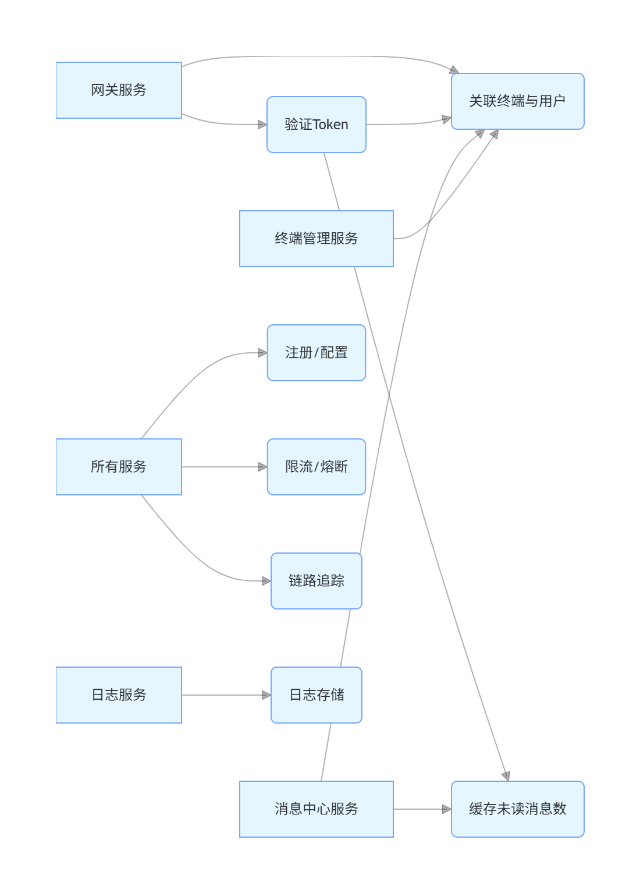

# java 项目基础骨架



```agsl
JavaBasicProject/  # 总父工程（管理所有服务的版本依赖）
├── pom.xml             # 总父POM：定义Spring Cloud Alibaba、Spring Boot等核心依赖版本
├── README.md           # 项目说明文档
├── docs/               # 项目文档（架构图、数据库设计等）

# 公共服务（所有业务服务依赖的通用模块）
├── common-service/                  # 公共服务父模块
│   ├── pom.xml                      # 公共服务父POM：声明子模块，继承总父POM
│   ├── common-core/                 # 核心工具模块
│   │   ├── pom.xml
│   │   └── src/main/java/com/platform/common/core/
│   │       ├── exception/           # 全局异常定义（如BusinessException）
│   │       ├── utils/               # 通用工具类（加密、JSON、日期等）
│   │       └── constant/            # 系统常量（如权限前缀、缓存键前缀）
│   ├── common-security/             # 安全组件模块
│   │   ├── pom.xml
│   │   └── src/main/java/com/platform/common/security/
│   │       ├── jwt/                 # JWT工具类（生成、解析、验证）
│   │       ├── annotation/          # 权限注解（如@RequiresPermission）
│   │       └── config/              # 安全配置基类
│   ├── common-db/                   # 数据库通用模块
│   │   ├── pom.xml
│   │   └── src/main/java/com/platform/common/db/
│   │       ├── base/                # 通用实体类（BaseEntity）、Mapper基类
│   │       └── config/              # MyBatis-Plus通用配置
│   ├── common-feign/                # 服务调用模块
│   │   ├── pom.xml
│   │   └── src/main/java/com/platform/common/feign/
│   │       ├── interceptor/         # Feign请求拦截器（添加Token等）
│   │       └── config/              # Feign通用配置
│   └── common-web/                  # Web通用模块
│       ├── pom.xml
│       └── src/main/java/com/platform/common/web/
│           ├── response/            # 统一响应体封装
│           ├── filter/              # 通用过滤器（如XSS过滤）
│           └── config/              # WebMvc通用配置

# 业务服务（每个服务为独立父模块，内部包含功能子模块）
├── gateway-service/                 # 网关服务父模块
│   ├── pom.xml                      # 网关服务父POM：声明子模块，依赖common-service
│   ├── gateway-api/                 # 网关API模块（对外暴露的接口）
│   │   ├── pom.xml
│   │   └── src/main/java/com/platform/gateway/api/
│   │       └── controller/          # 网关管理接口（如路由配置接口）
│   ├── gateway-core/                # 网关核心模块
│   │   ├── pom.xml
│   │   └── src/main/java/com/platform/gateway/core/
│   │       ├── config/              # 网关核心配置（路由、限流等）
│   │       └── filter/              # 网关过滤器（认证、灰度路由等）
│   ├── gateway-dynamic-route/       # 动态路由模块
│   │   ├── pom.xml
│   │   └── src/main/java/com/platform/gateway/dynamic/
│   │       └── service/             # 动态路由服务（监听Nacos配置）
│   └── gateway-gray/                # 灰度发布模块
│       ├── pom.xml
│       └── src/main/java/com/platform/gateway/gray/
│           └── rule/                # 灰度路由规则（基于用户/服务标签）

├── sso-service/                     # SSO认证服务父模块
│   ├── pom.xml                      # 依赖common-service，声明子模块
│   ├── sso-api/                     # SSO对外API模块
│   │   ├── pom.xml
│   │   └── src/main/java/com/platform/sso/api/
│   │       └── controller/          # 登录、Token接口
│   ├── sso-core/                    # SSO核心模块
│   │   ├── pom.xml
│   │   └── src/main/java/com/platform/sso/core/
│   │       ├── service/             # 认证核心逻辑
│   │       └── config/              # Security配置
│   └── sso-client/                  # SSO客户端模块（供其他服务集成）
│       ├── pom.xml
│       └── src/main/java/com/platform/sso/client/
│           └── filter/              # 客户端认证过滤器

├── user-auth-service/               # 用户权限服务父模块
│   ├── pom.xml
│   ├── user-api/                    # 用户权限API模块
│   │   ├── pom.xml
│   │   └── src/main/java/com/platform/user/auth/api/
│   │       └── controller/          # 用户、角色、菜单接口
│   ├── user-core/                   # 用户管理模块
│   │   ├── pom.xml
│   │   └── src/main/java/com/platform/user/auth/core/user/
│   ├── org-core/                    # 机构管理模块
│   │   ├── pom.xml
│   │   └── src/main/java/com/platform/user/auth/core/org/
│   ├── role-core/                   # 角色管理模块
│   │   ├── pom.xml
│   │   └── src/main/java/com/platform/user/auth/core/role/
│   ├── menu-core/                   # 菜单管理模块（含动态路由）
│   │   ├── pom.xml
│   │   └── src/main/java/com/platform/user/auth/core/menu/
│   └── data-perm-core/              # 数据权限模块
│       ├── pom.xml
│       └── src/main/java/com/platform/user/auth/core/dataperm/

# 其他服务采用相同模式（父模块+功能子模块）
├── terminal-service/                # 终端管理服务
│   ├── pom.xml
│   ├── terminal-api/
│   ├── terminal-manage-core/
│   └── terminal-status-core/
├── log-service/                     # 日志服务
│   ├── pom.xml
│   ├── log-api/
│   ├── operate-log-core/
│   └── error-log-core/
├── file-service/                    # 文件服务
├── message-service/                 # 消息中心服务
├── cache-service/                   # 缓存管理服务
├── code-gen-service/                # 代码生成服务
├── api-doc-service/                 # 聚合文档服务
├── monitor-service/                 # 服务监控服务
└── job-service/                     # 分布式任务调度服务

# 基础设施配置（非代码模块）
├── infrastructure/
│   ├── nacos-config/                # Nacos配置文件
│   ├── sentinel-rules/              # Sentinel限流规则
│   └── seata-config/                # Seata分布式事务配置

# 前端工程
├── frontend/
│   ├── package.json
│   └── src/                         # 前端代码（基于后端动态路由渲染）

# 部署配置
├── deploy/
    ├── docker/                      # 每个服务的Dockerfile
    └── k8s/                         # Kubernetes部署配置

```